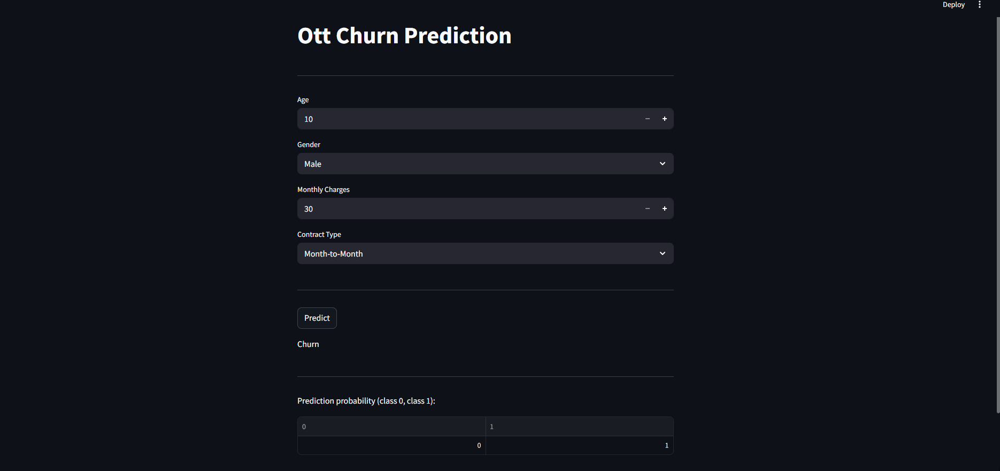
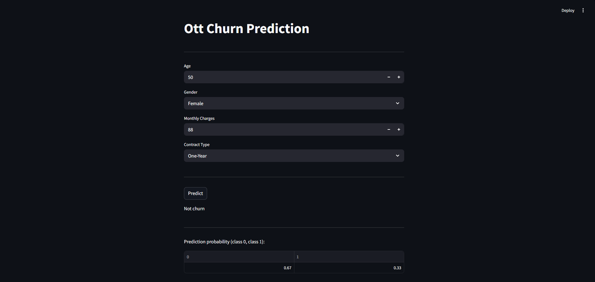

# 📺 OTT Churn Prediction App

This project is a machine learning-based web application built with **Streamlit** to predict whether a customer will churn from an OTT (Over-The-Top) media service, based on key user attributes.

## 🚀 Features

- Predicts customer churn using age, gender, monthly charges, and contract type.
- Interactive and user-friendly interface built with Streamlit.
- Uses a trained classification model (Random Forest) with preprocessing (StandardScaler).
- Handles class imbalance to improve minority class prediction.

## 🧠 Model Details

- **Model**: RandomForestClassifier
- **Preprocessing**: StandardScaler (for numerical features)
- **Handling Imbalance**: `class_weight='balanced'`
- **Accuracy**: ~87.5% on imbalanced dataset

## 📊 Input Features

| Feature         | Type       | Description                               |
|----------------|------------|-------------------------------------------|
| Age            | Numeric    | Customer's age                            |
| Gender         | Categorical| Male or Female (encoded)                  |
| MonthlyCharges | Numeric    | Subscription charges per month            |
| ContractType   | Categorical| Month-to-Month, One-Year, or Two-Year     |

---

## 🖼️ Screenshots

### 🔹 Start Page (`c1.png`)



---

### 🔹 Prediction Page (`c2.png`)

> Example: A new input results in a "Not Churn" prediction.



---

## 🛠️ How to Run Locally

1. **Clone the repo**
   ```bash
   git clone https://github.com/yourusername/ott-churn-prediction.git
   cd ott-churn-prediction
